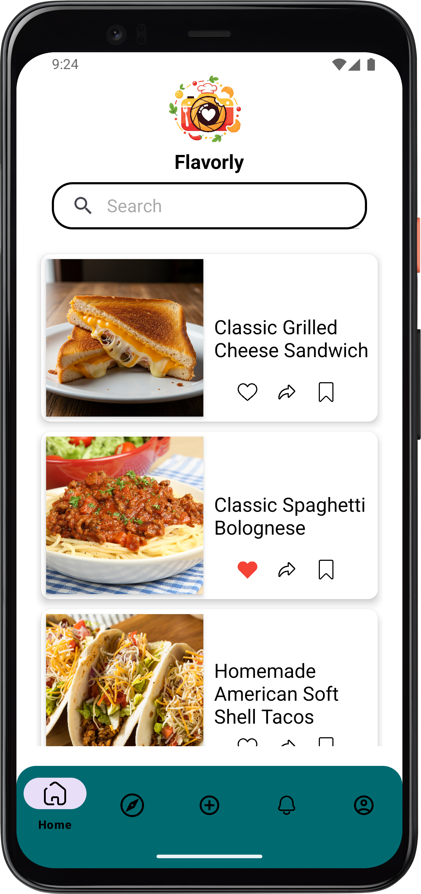
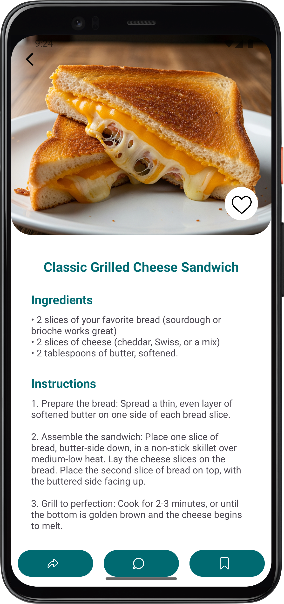
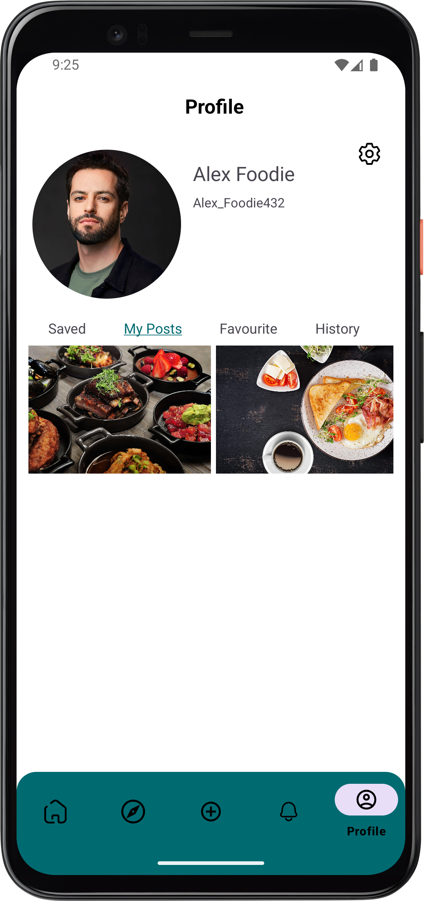

# 🍳 Flavorly Mobile App

**Flavorly** is a native Android application built with Kotlin, designed as a comprehensive guide for users who love cooking and exploring new food experiences. Whether you are a beginner cook or a seasoned chef, Flavorly helps you discover delicious recipes with a beautiful, intuitive user interface.

## 📱 Screenshots

| Home Screen | Recipe Details | Profile |
|:---:|:---:|:---:|
|  |  |  |

## ✨ Features

* **Intuitive UI/UX:** Clean, modern interface built with Android Material Design principles.
* **Dynamic Display:** Smooth scrolling and efficient data rendering using `RecyclerView`.
* **Easy Navigation:** Seamless transitions between exploring food categories and viewing specific recipes.

## 🛠️ Tech Stack & Architecture

* **Language:** Kotlin
* **IDE:** Android Studio
* **UI Components:** XML, Material Design, RecyclerView, ConstraintLayout
* **Version Control:** Git & GitHub

